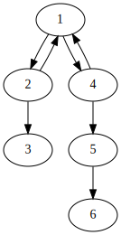

## Game on Graph

$\texttt{Gennady}$ 和 $\texttt{Georgity}$ 正在一个有向图上玩有趣的游戏。这个有向图上有 $n$ 个点和 $m$ 条边，允许自环存在。

在一轮游戏中，一开始 $\texttt{Gennady}$ 和 $\texttt{Georgity}$ 在其中一个节点上放了一个硬币。

每一步当前的玩家，可以将硬币沿着**起点为当前硬币所在点**的有向边移动，移动到这条边的终点。形式化地讲，假设硬币在 $u$，它可以移动到点 $v$ 当且仅当存在有向边 $(u, v)$。

在每一步 $\texttt{Gennady}$ 和 $\texttt{Georgity}$ 交替地执行移动操作，不能移动的玩家输。

$\texttt{Gennady}$ 更倾向于使局面陷入无止尽：

- 如果他有策略使游戏永远不会结束，他就会使用这个策略。
- 否则：
   - 如果有策略能使他胜利，他就会使用这个策略。
   - 否则他会使用能使他失败的策略。

$\texttt{Georgity}$ 更倾向于获胜：

- 如果他有策略能使他胜利，他就会使用这个策略。
- 否则：
   - 如果他有策略能使他失败，他就会使用这个策略。
   - 否则他会使用使游戏永远不会结束的策略。

$\texttt{Gennady}$ 和 $\texttt{Georgity}$ 都使用最佳策略。

现在对于每个点，假设硬币一开始放在这里，你需要分别输出 $\texttt{Gennady}$ 和 $\texttt{Georgity}$ 先手时的最终状态。

### 输入格式
第一行两个整数 $n, m$，分别表示节点数和有向边数。

下面 $m$ 行，每行两个正整数 $a_i, b_i$，标示存在一条从节点 $a$ 到节点 $b$ 的有向边。

图节点从 $1$ 到 $n$ 编号。保证不存在重边，即不存在 $1 \leq i < j \leq m$ 使得 $a_i = a_j$ 且 $b_i = b_j$。

### 输出格式
输出一共两行。

第一行表示 $\texttt{Gennady}$ 先手。第二行表示 $\texttt{Georgity}$ 先手。

每一行是一个长度为 $n$ 的字符串，第 $i$ 个字符表示硬币一开始在节点 $i$ 时的最终状态：

- 如果先手胜利了，用字符 “W” 代表这个状态。 
- 如果后手胜利了，用字符 “L” 代表这个状态。
- 如果游戏永远不会结束，用字符 “D” 代表这个状态。

### 样例一
#### input
<pre>
6 7
1 2
2 1
2 3
1 4
4 1
4 5
5 6

</pre>

#### output
<pre>
WDLDWL
DWLLWL

</pre>

#### explanation

对于任何一个人在节点 $3$ 或 $6$ 先手，硬币已经不能动了，此时先手必败。

对于任何一个人在节点 $5$ 先手，只能走到 $6$，此时先手必胜。

对于 $\texttt{Georgity}$ 在 $1$ 先手或 $\texttt{Gennady}$ 在 $2, 4$ 先手，$\texttt{Gennady}$ 总能到达节点 $1$，所以游戏永远不会结束。

对于 $\texttt{Georgity}$ 在 $4$ 先手，如果选择 $1$，会使游戏永远不会结束，如果选择 $5$ 是必败的，那么他会选择 $5$ 号点，达到失败的状态。

对于 $\texttt{Georgity}$ 在 $2$ 先手，显然他可以直接走到 $3$ 使得自己胜利。

对于 $\texttt{Gennady}$ 在 $1$ 先手，选择 $2$ 会使自己失败，选 $4$ 会使自己胜利，但无论如何都不能使游戏永远不结束。所以最终他会胜利。

### 限制与约定
对于所有数据，都有 $1 \leq n \leq 10^5$，$1 \leq m \leq 2 \times 10^5$。

**时间限制**：$1 \texttt{s}$

**空间限制**：$512 \texttt{MB}$
